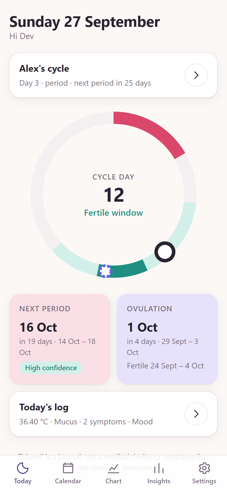
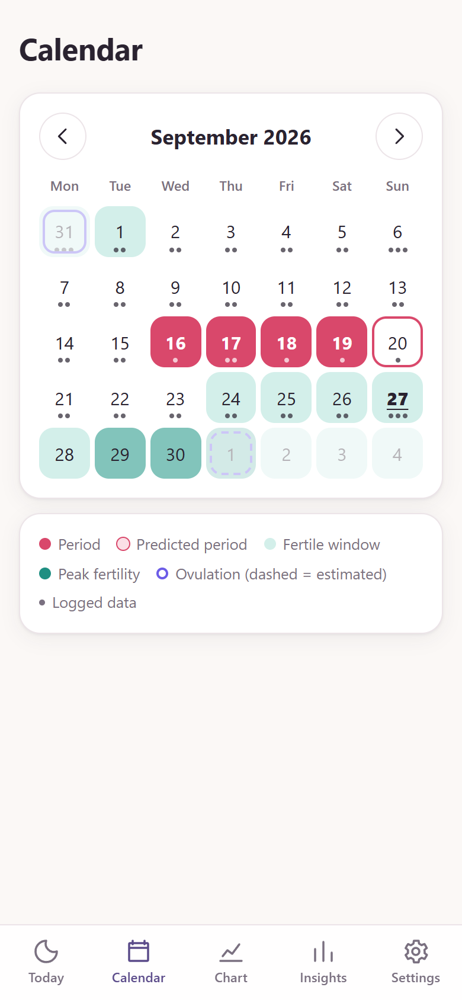
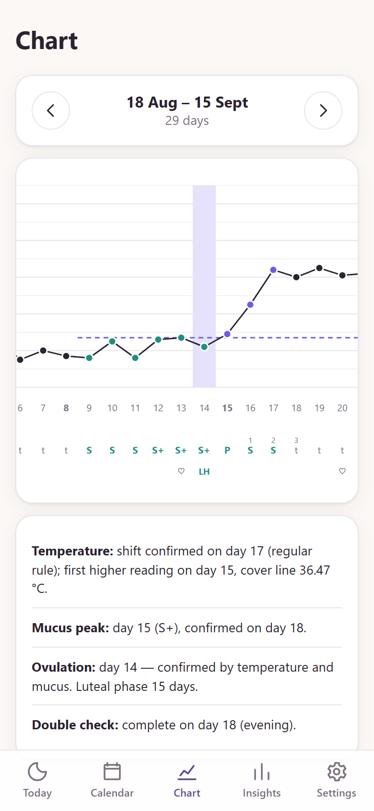
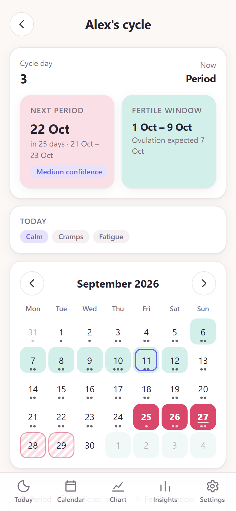

<p align="center"></p>

# Ebbwell

A private, self-hosted period tracker and ovulation estimator. It runs as a web app you can install on iPhone, Android and desktop, and you host it yourself (Docker / TrueNAS SCALE). Sign-in uses your own OpenID Connect provider (Authentik, Authelia, Keycloak, Pocket ID…) and/or local accounts, which you can restrict to your home network.

<p align="center">
  
  
  
  
</p>

## Why

Calendar-only period apps predict the ovulation day correctly only about 8–21% of the time. They also have a record of sharing intimate data with third parties. Ebbwell does it differently. See **[docs/PROPOSAL.md](docs/PROPOSAL.md)** for the research behind each feature.

- **Learns your cycle.** Personal statistics replace the textbook "day 14". Every prediction comes with a range and a confidence level, and irregular cycles are flagged using FIGO 2018 thresholds.
- **Confirms ovulation with body signs.** It applies the Sensiplan temperature rule (both exceptions), the cervical-mucus peak day and the double check, and uses LH tests. Once ovulation is confirmed, the next period is predicted from your own luteal phase.
- **Private by design.**
  - Everything is encrypted at rest (AES-256-GCM, bound to each row).
  - The app makes zero third-party requests and has a strict CSP.
  - The service worker never caches health data.
  - Users get full export and one-tap deletion.

## Features

| | |
|---|---|
| Daily log | Bleeding, basal temperature (time, disturbances, exclusion), cervical mucus (Sensiplan categories), cervix, LH and pregnancy tests, sex, symptoms, mood, notes |
| Quick entry | Type or say one sentence ("36.52 at 6:45, light bleeding, cramps, tired") and the day's form fills in. Understood in English, French, German and Arabic; the text is read in the browser and never sent anywhere |
| Voice input | Per device: the keyboard's dictation, or Whisper running on the phone itself (downloaded once from your server, about 79 MB). Audio never leaves the device |
| Insights | Cycle and period length, variation, luteal phase, per-cycle ovulation method, exclude unusual cycles, pregnancy/pause mode |
| Predictions | Next 3 periods, fertile window, ovulation with ranges and confidence; late-period detection with a pregnancy-test hint |
| Sensiplan evaluation | Opt-in for people who learned the method: 5-day / minus-8 rules, post-ovulatory double check |
| Reminders | Web Push: morning temperature, evening check-in, period coming, fertile window, partner's period. Discreet wording by default |
| App lock | Server-enforced PIN, Face ID / Touch ID / fingerprint (WebAuthn), auto-lock, lockout after 5 wrong PINs, PIN reset only after a fresh identity-provider login |
| Partner sharing | Single-use invite link; read-only view with owner-chosen scopes (fertility, history, symptoms & mood). Notes and intimate details are never shared. Partners can use a follow-only mode without tracking anything themselves |
| Accounts | Single sign-on (OIDC + PKCE) and/or local accounts. You choose where passwords are accepted: nowhere, local network only (never through the public domain), or everywhere. Optional or required two-factor authentication (authenticator app + recovery codes). Admin panel: create/reset/disable accounts, reset 2FA; admins never see cycle data |
| Security | Hashed server-side sessions, device list, CSRF protection, rate limiting and account lockout, audit log, key rotation, daily encrypted backups |
| Platforms | Installable PWA (iOS 16.4+, Android, desktop), light/dark, offline app shell |
| Languages | English, French, German and Arabic (right-to-left), chosen per user in Settings or following the device; sign-in pages and reminders too |

> Ebbwell is a journal, **not a medical device and not a contraceptive**.

## Deploy

```bash
docker run -d --name ebbwell -p 8080:8080 -v ebbwell-data:/data \
  -e APP_URL=https://ebbwell.example.com \
  -e OIDC_ISSUER=https://auth.example.com/application/o/ebbwell/ \
  -e OIDC_CLIENT_ID=... -e OIDC_CLIENT_SECRET=... \
  -e LOCAL_LOGIN=local-network -e ADMIN_USERNAME=admin -e ADMIN_PASSWORD=... \
  -e DATA_ENCRYPTION_KEY="$(openssl rand -base64 32)" \
  ghcr.io/maxren2/ebbwell:0.7.2
```

Keep a copy of `DATA_ENCRYPTION_KEY`: without it the data can't be decrypted.

**[docs/DEPLOY.md](docs/DEPLOY.md)** covers:

- the Authentik provider, and local accounts with the network policy;
- TrueNAS "Install via YAML" ([deploy/truenas-compose.yaml](deploy/truenas-compose.yaml));
- the reverse proxy;
- phone installation, reminders, the app lock and partner sharing;
- backups and key rotation.

All settings are listed in [.env.example](.env.example).

## Develop

```bash
npm ci
cp .env.example .env.dev    # set AUTH_MODE=dev, ALLOW_INSECURE_DEV_AUTH=true, APP_URL=http://localhost:8080, DATA_DIR=.data and a key
npm run build               # builds the PWA into dist/
node scripts/fetch-models.ts  # optional: the Whisper models for voice input (./models, ~120 MB)
node --env-file=.env.dev scripts/seed-demo.ts   # optional: demo cycles + a shared partner cycle
node --env-file=.env.dev server/index.ts        # http://localhost:8080/auth/login
npm test                    # engine rules, API security, lock, push, sharing, OIDC flow against a mock provider
npm run typecheck
```

The server is TypeScript run directly by Node 24 (type stripping), with no build step and no native modules. SQLite comes from `node:sqlite`.

```
shared/   cycle engine, partner view and quick-entry parser (pure TS, shared by browser and server) + zod schemas
          + translations (shared/i18n: en.ts is the reference, the compiler checks the others)
server/   Fastify API: OIDC, sessions, app lock, Web Push, sharing, encrypted SQLite store, backups
web/      React PWA + service worker
test/     vitest suites
deploy/   TrueNAS compose file
docs/     proposal and deployment guide
```

## License

[AGPL-3.0-or-later](LICENSE). If you run a modified Ebbwell for other people, you must offer them its source code.
